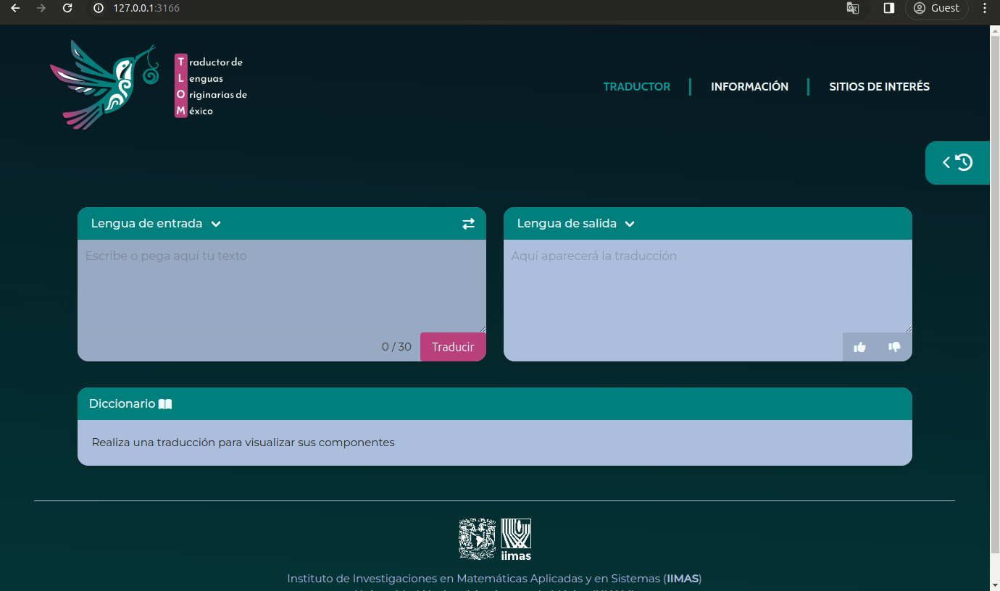

<p align="center">

</p>

# TLOM: Interfaz WebApp para traductores

[](https://www.python.org/)
[
](https://fastapi.tiangolo.com/)

[](https://bulma.io/)


La ***interfaz webapp para traductores*** de lenguas originarias de México es un proyecto desarrollado por el [***Laboratorio L52+***](https://l52mas.gitlab.io/) del 
[***Instituto de Investigaciones en Matemáticas Aplicadas y en Sistemas***](https://www.iimas.unam.mx), [***UNAM***](https://www.unam.mx).  Su objetivo es brindar una interfaz eficiente y accesible que pueda contribuir a la disminución de las barreras culturales y lingüísticas entre las comunidades indígenas de México y el resto de los habitantes, así como apoyar la preservación de las lenguas originarias de nuestro país. 

## Arquitectura 

<p align="center">

</p>

## Estructura del repositorio
El `front-end` (lado del cliente) comprende lo siguiente: 

<pre>
├── static
|   ├── index.js
|   ├── style.css
|   ├── LogoUNAM_IIMAS_Negro.png
|   ├── tlom-icono.png
|   └── tlom-logo.png
├── templates
|   └── home.html
</pre>

El `back-end` (lado del servidor) comprende:

<pre>
├── api
|   ├── __init__.py
|   ├── main.py
|   ├── tasks.py
|   ├── const.py
|   └── const2.py
├── models
|   ├── model1.py
|   └── model2.py
├── data
|   ├── corpus.mir
|   └── corpus.spa
</pre>

## Instalación local
Para crear una copia de este proyecto en tu equipo local, ve al comienzo del repositorio y haz clic en `code`. Tienes la opción de descargar el código o clonarlo. 

Para clonar este proyecto usando git, copia la URL `HTTPS` o `SSH` (si tienes habilitadas las llaves de acceso en git). Abre una terminal en la ubicación donde quieres clonar el directorio, escribe `git clone`, pega la dirección URL que has copiado antes y ejecuta.

Una vez clonado o descargado el repositorio, accede a él:

```bash
  cd tlom
  ```

A continuación, crea un ambiente virtual con la librería `venv` en el directorio `env` con el comando: 

```bash
  python3.11 -m venv env
  ```

Activa el ambiente virtual:

```bash
  source env/bin/activate
  ```

Instala los requerimientos del proyecto:

```bash
  pip install -r requirements.txt
  ```
Para correr la aplicación en vivo en el `puerto 3166` ejecuta:

```bash
  uvicorn api.main:app --port 3166 --reload
  ```
En el output verás la URL dónde se está corriendo la aplicación en tu maquina local:
```bash
  INFO:     Uvicorn running on http://127.0.0.1:3166 (Press CTRL+C to quit)
  ```
Si la aplicación está funcionando correctamente, si abres http://127.0.0.1:3166/ en tu navegador podrás ver la página principal de la interfaz webapp.

## Demo
<p align="center">
 
</p>

## Documentación
La [**Documentación Interfaz Web App**](https://piragua.notion.site/Interfaz-Web-App-95e829c1483c4f6cb756020c4a8318d9?pvs=4) en Notion expone el desarrollo y conceptos clave de este proyecto.

## Autores
Este proyecto fue realizado por 
[jazmingar](https://gitlab.com/jazmingar) (Mónica Jazmín García Sarabia) bajo la asesoría de [ivanvladimir](https://gitlab.com/ivanvladimir) (Ivan Vladimir Meza Ruiz) para el programa de Servicio Social "***Desarrollo de sistemas inteligentes usando deep learning***". 
